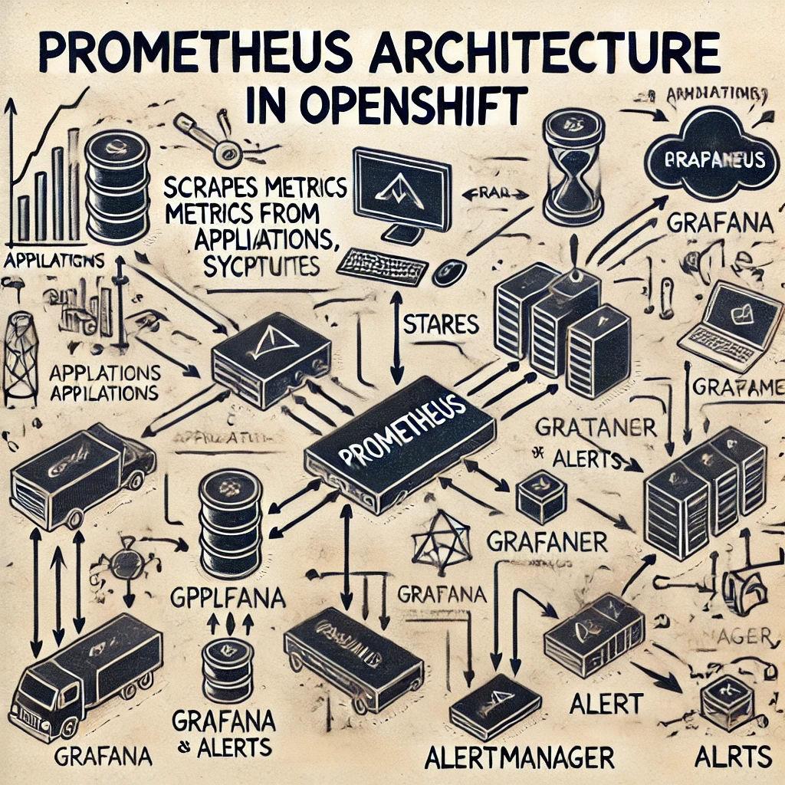
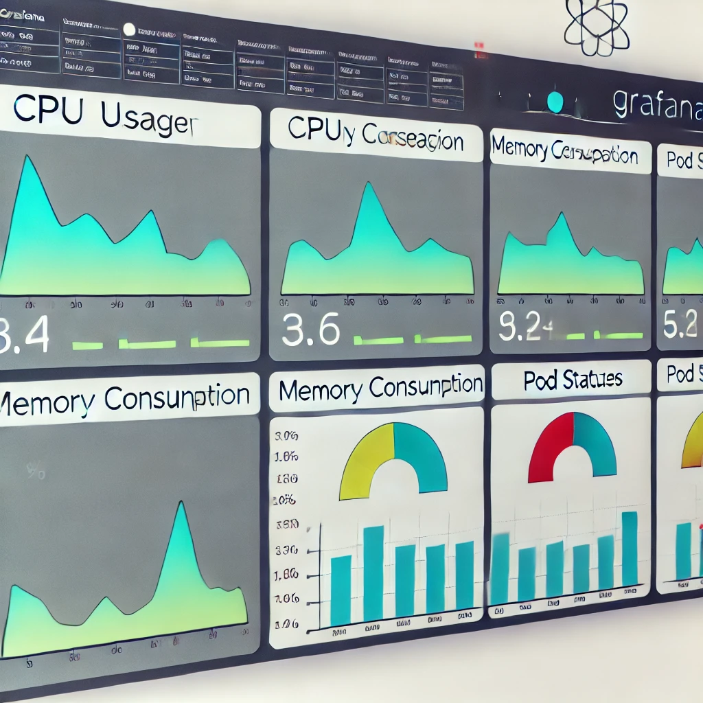
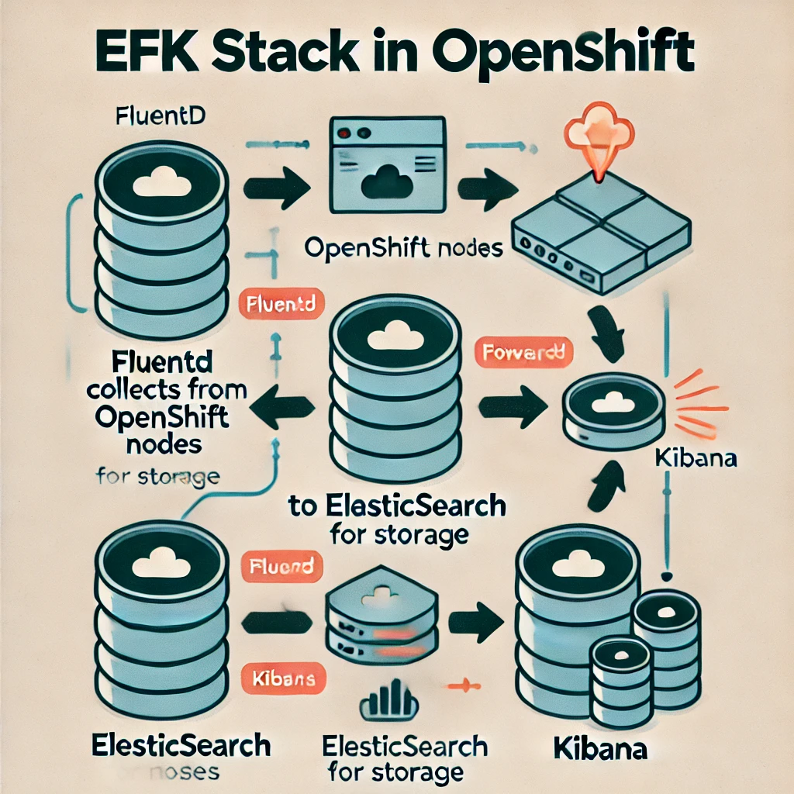
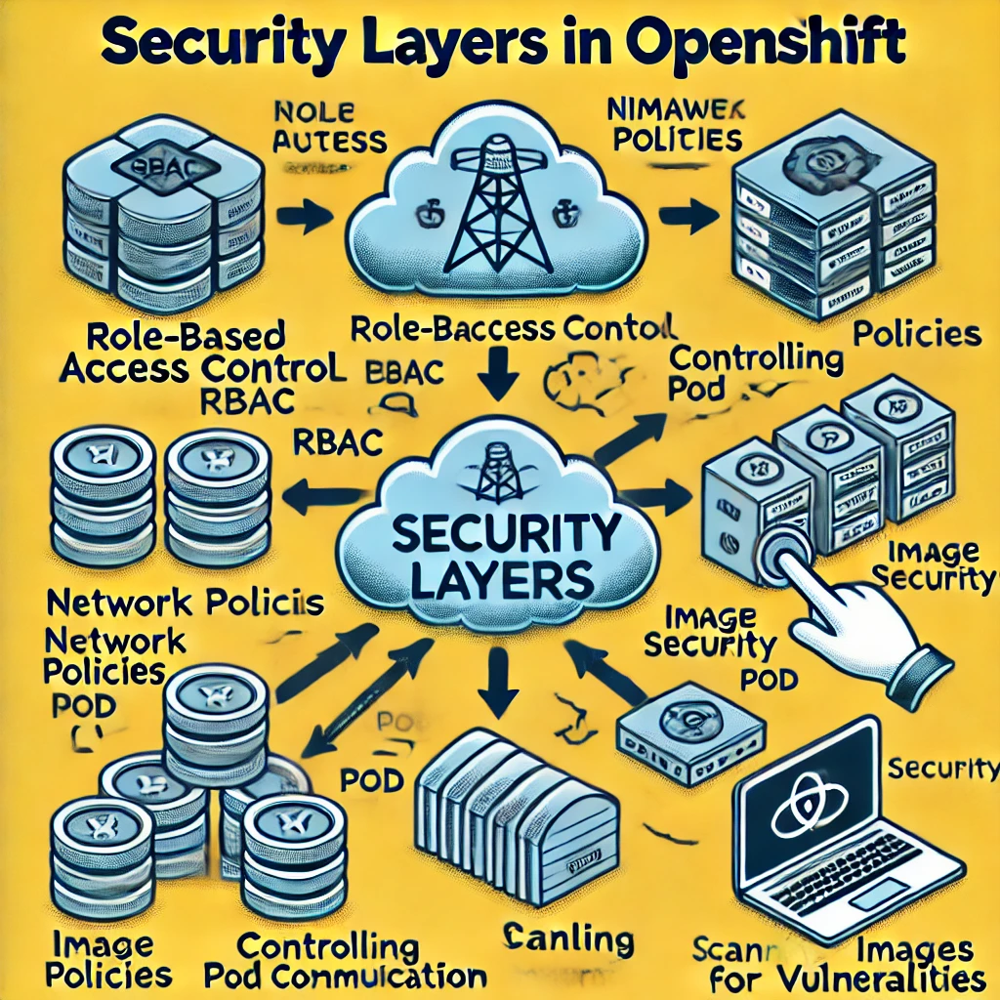
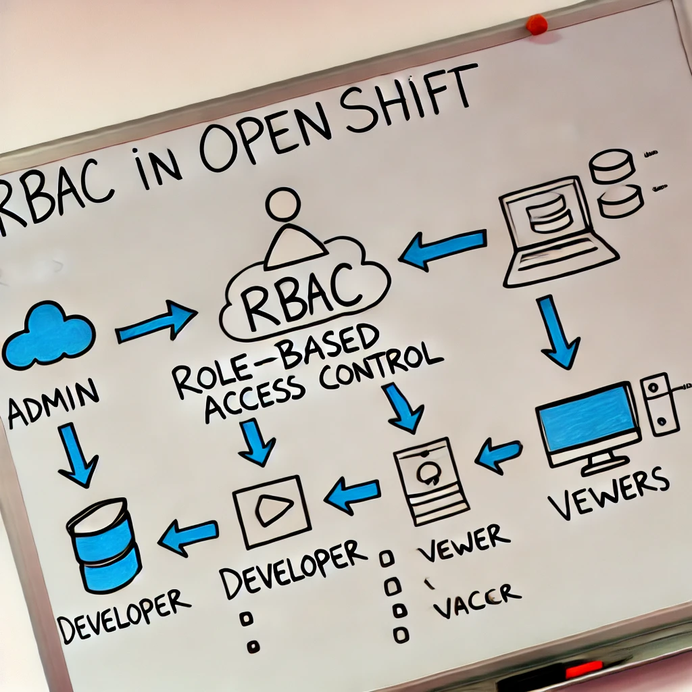

# Basic Monitoring, Logging, Security, and Access Control 
Here’s content and image descriptions for the new topics to help you prepare your presentation on OpenShift monitoring, logging, security best practices, and access control policies.

### 1. **Monitoring Applications in OpenShift**

Monitoring is essential for ensuring the health and performance of applications in OpenShift. OpenShift uses **Prometheus** for monitoring, and **Grafana** for visualization, with **Alertmanager** handling alerts.

#### Key Concepts:
- **Prometheus**: Scrapes metrics from applications and system components, stores them, and triggers alerts.
- **Grafana**: Provides dashboards for visualizing metrics.
- **Alertmanager**: Sends alerts to different channels (email, Slack, etc.) when issues arise.

#### Image 1: Prometheus Architecture in OpenShift
- A diagram showing how Prometheus scrapes metrics from applications and components, stores them, and integrates with Grafana and Alertmanager.

#### Image 2: Grafana Dashboard Example
- A visual of a Grafana dashboard displaying metrics like CPU usage, memory consumption, and pod statuses in an OpenShift environment.

---

### 2. **Logging in OpenShift**

Logging is crucial for tracking application behavior and troubleshooting issues. OpenShift uses **ElasticSearch**, **Fluentd**, and **Kibana (EFK)** for its logging stack.

#### Key Concepts:
- **Fluentd**: Collects logs from nodes and forwards them to ElasticSearch.
- **ElasticSearch**: Stores and indexes log data.
- **Kibana**: Visualizes log data and helps in querying logs.

#### Image 3: EFK Stack in OpenShift
- A flowchart showing the Fluentd to ElasticSearch to Kibana (EFK) pipeline. Fluentd collects logs from OpenShift nodes, ElasticSearch stores them, and Kibana visualizes the logs.

#### Image 4: Kibana Log Visualization
- A simple visualization of Kibana querying logs from OpenShift with filters for different applications.

---

### 3. **Security Best Practices in OpenShift**

Security is a critical aspect of managing OpenShift clusters, and there are several best practices to follow to ensure a secure environment.

#### Key Concepts:
- **Role-Based Access Control (RBAC)**: Ensures users have the right level of access to resources.
- **Network Policies**: Control how pods communicate with each other and external systems.
- **Image Security**: Use trusted images and scan them for vulnerabilities regularly.

#### Image 5: Security Layers in OpenShift
- A diagram showing different security layers: RBAC, Network Policies, and Image Security.

#### Image 6: Pod Security Policies (PSPs)
- A visual showing how pod security policies restrict the permissions and capabilities of pods (e.g., preventing privileged pods).

---

### 4. **Access Control Policies and Practices**

Access control ensures that only authorized users and applications can interact with OpenShift resources.

#### Key Concepts:
- **Role-Based Access Control (RBAC)**: Controls access based on roles and permissions.
- **OAuth and Identity Providers**: OpenShift integrates with OAuth for managing user access.
- **ServiceAccounts**: Special accounts for pods and services to control their access to resources.

#### Image 7: RBAC in OpenShift
- A flowchart showing how different roles and permissions control access to resources in OpenShift.

