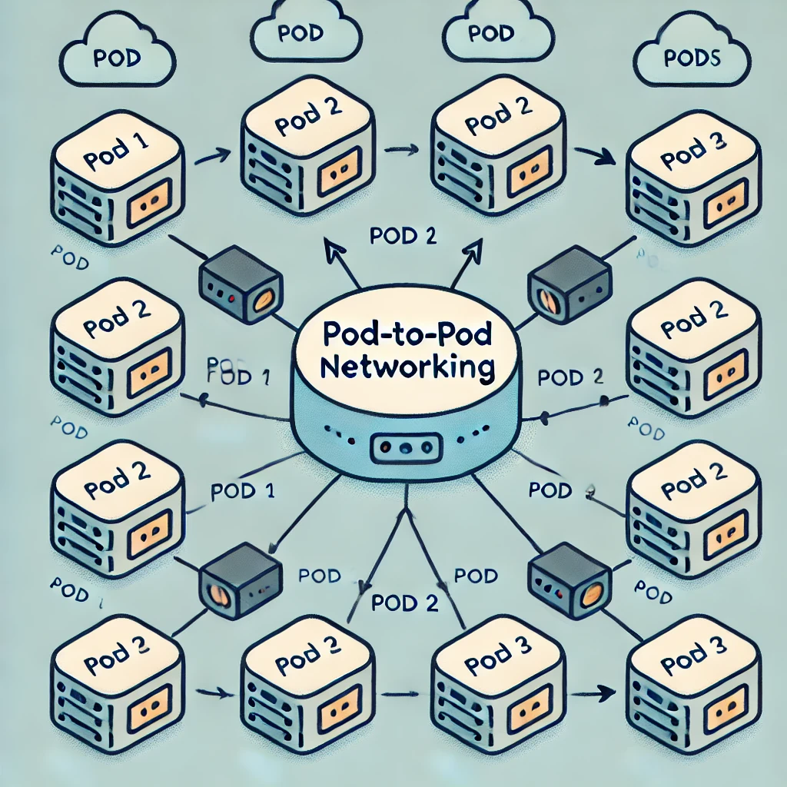
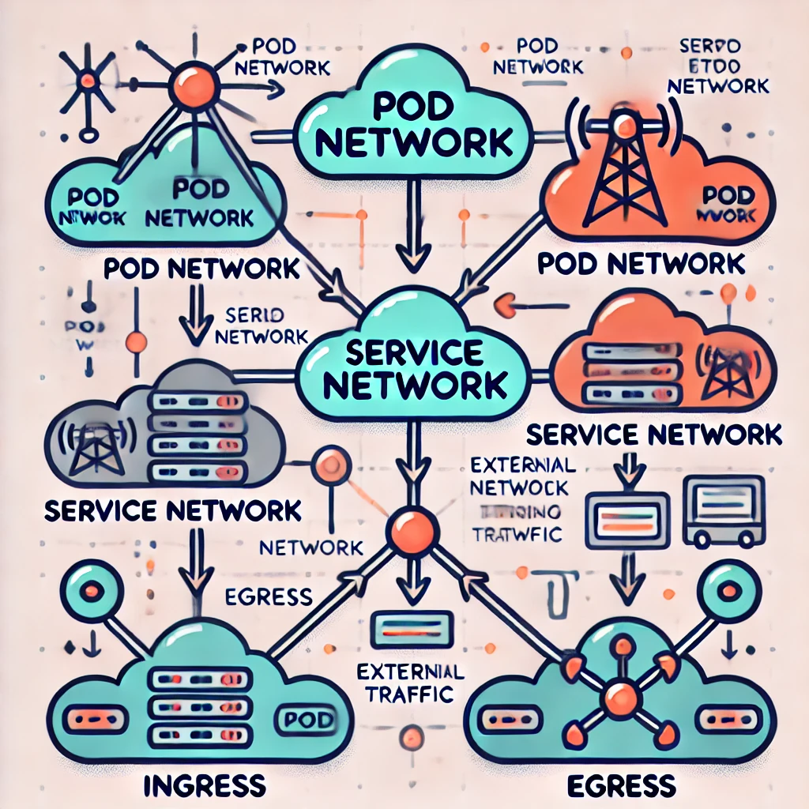
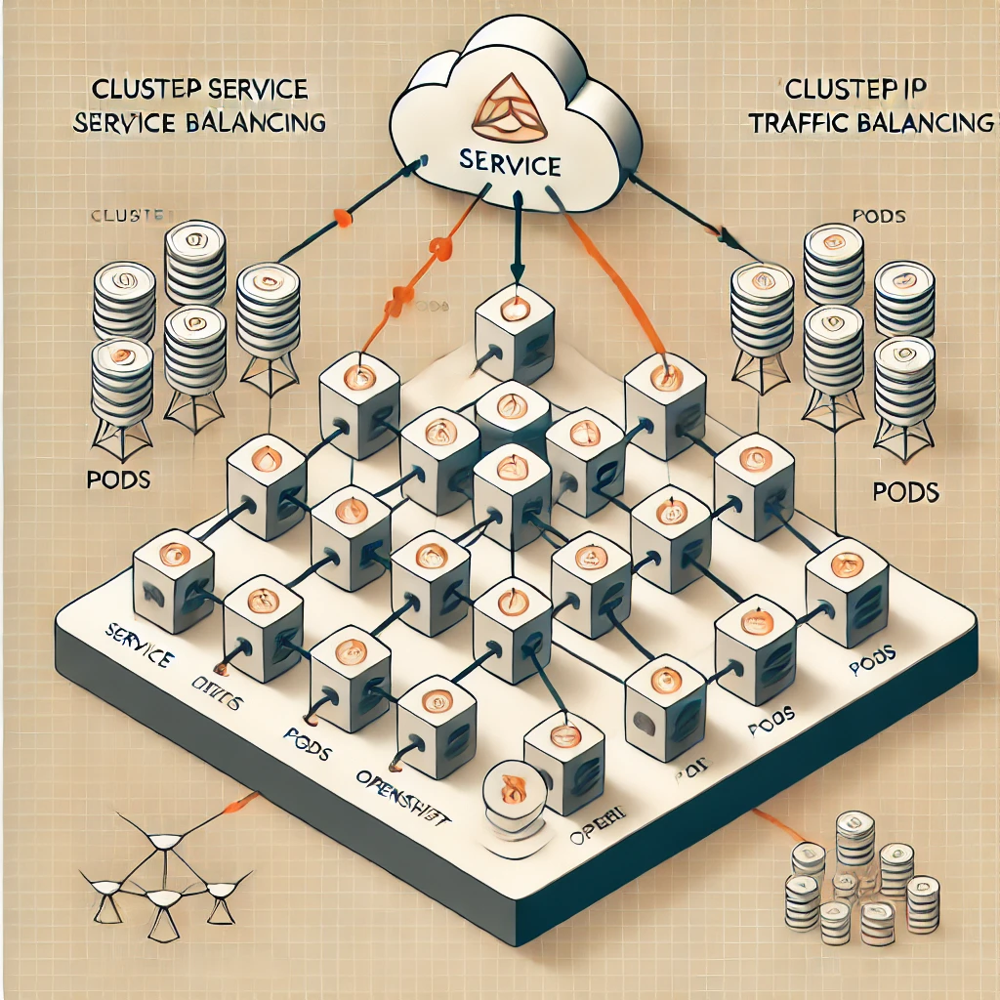
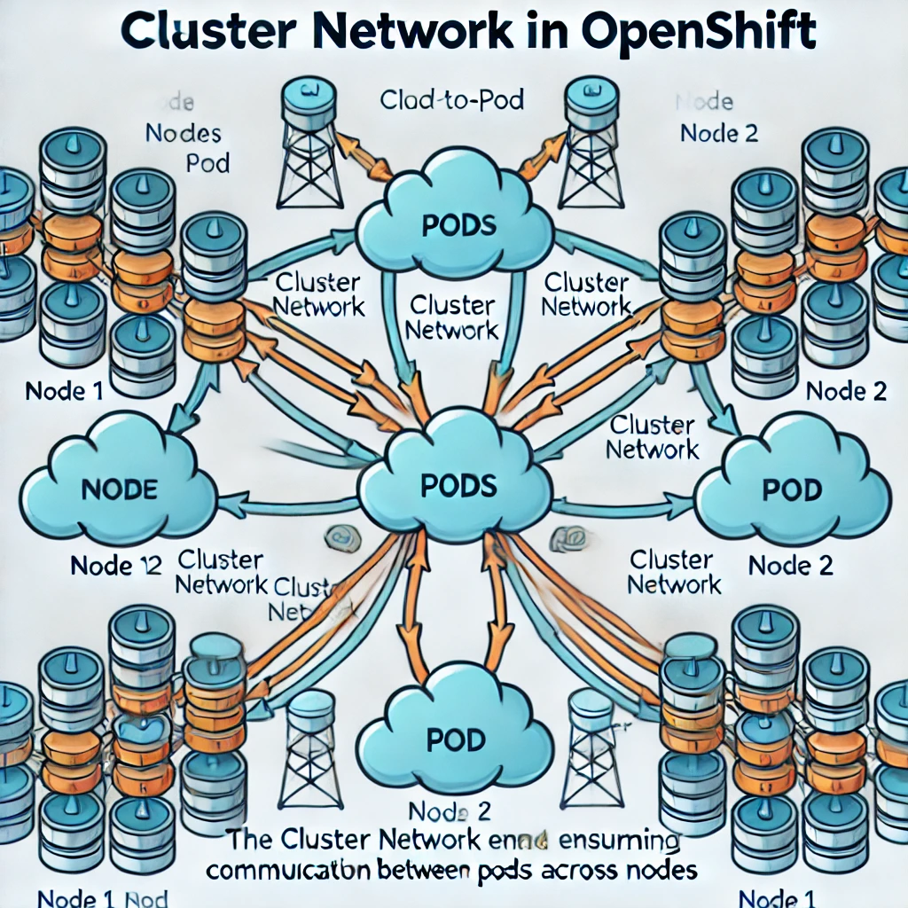
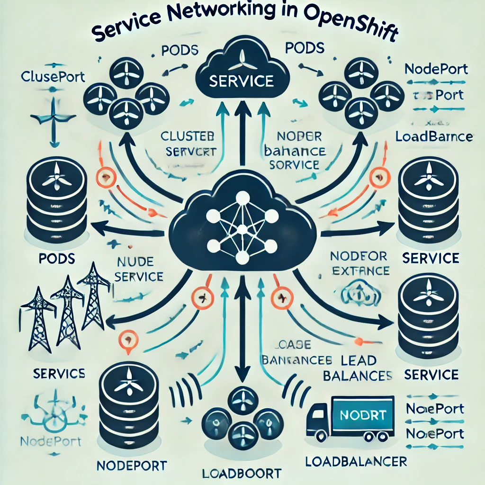
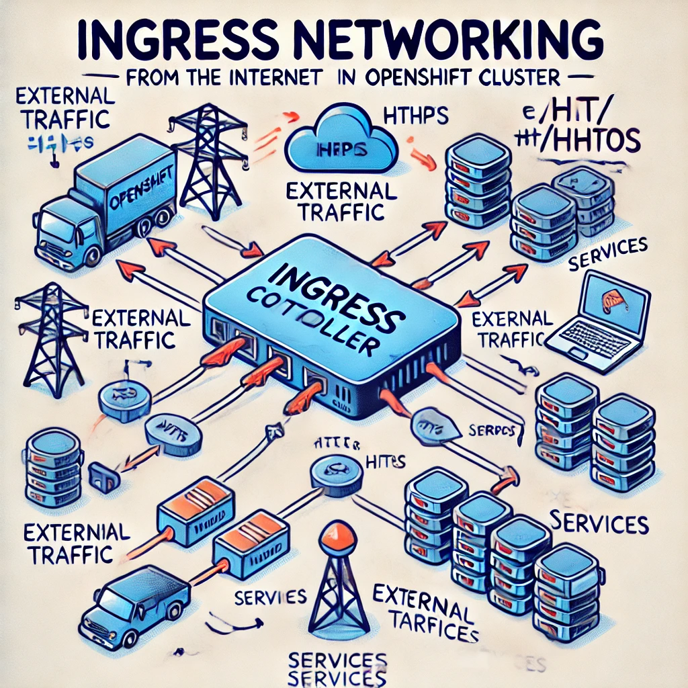
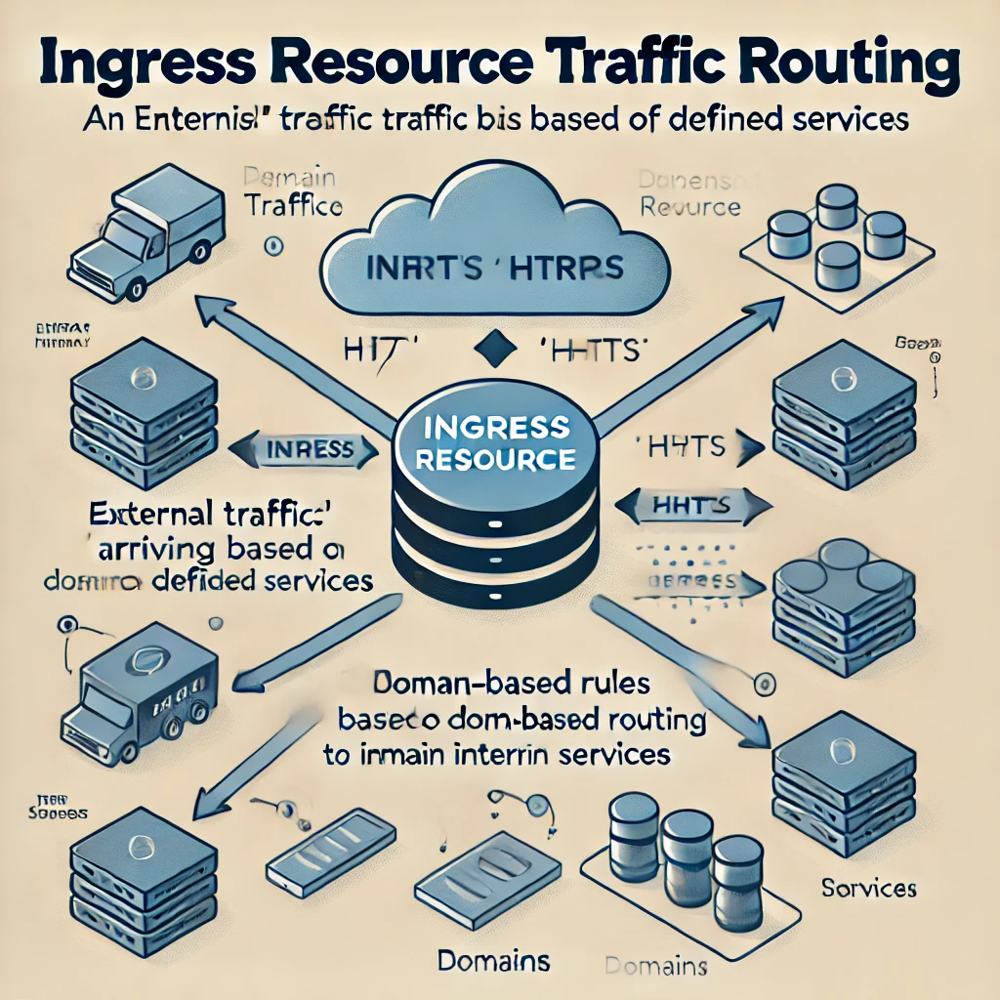

#  Introduction to OpenShift Networking

### 1. **Networking Basics in OpenShift**

OpenShift uses a Software Defined Networking (SDN) layer to abstract the complexities of container communication.

#### Key Concepts:
- **Pods**: The smallest deployable unit in OpenShift. Each pod is assigned an IP address.
- **Services**: Provide a stable network identity for a set of pods. They balance traffic among pods.
- **Ingress**: Exposes services to external networks, controlling how traffic enters the cluster.

#### Image 1: Basic Pod-to-Pod Networking
- A diagram showing multiple pods within an OpenShift cluster, each with unique IPs, communicating directly.
 

#### Image 2: Overview of Networking Layers
- A diagram depicting the three layers: Pod-to-Pod, Pod-to-Service, and External-to-Service networking in an OpenShift cluster

---

### 2. **Types of Networking in OpenShift**

OpenShift supports several types of networking models to handle communication within and outside the cluster. The most common types are:

#### a. **Cluster Network (Pod Network)**
   - The default networking model where each pod gets an IP address. Pods can communicate across nodes.
   - OpenShift’s SDN ensures that traffic between pods, even on different nodes, is seamless.

#### b. **Service Network**
   - OpenShift services act as stable endpoints for a set of pods, providing load balancing and service discovery.
   
#### c. **Ingress and Egress Networking**
   - Ingress networking allows external traffic to enter the cluster via Ingress Controllers.
   - Egress controls the outbound traffic from the pods.

#### Image 3: Types of Networking in OpenShift
- A flowchart showing the different types of networking: Pod network, service network, ingress, and egress.

#### Image 4: Cluster Network (Pod Network)
- A diagram showing how pods across different nodes communicate using the cluster network.

---

### 3. **Service Networking in OpenShift**

Service networking ensures that pods can be accessed through a stable endpoint, even as individual pods are destroyed and recreated. The service will load-balance the traffic among the available pods and expose them via ClusterIP, NodePort, or LoadBalancer.

#### Types of Services:
- **ClusterIP**: Exposes the service only inside the cluster.
- **NodePort**: Exposes the service on each node's IP, accessible externally via a static port.
- **LoadBalancer**: Integrates with cloud provider’s load balancer to expose the service externally.

#### Image 5: Service Networking (ClusterIP)
- A diagram showing how a service with `ClusterIP` balances traffic among a group of pods within the cluster.

#### Image 6: Service Networking (NodePort and LoadBalancer)
- A diagram illustrating how a service exposed via `NodePort` and `LoadBalancer` allows external access to pods in the OpenShift cluster.

---

### 4. **Ingress Networking in OpenShift**

Ingress networking in OpenShift controls how external traffic accesses services inside the cluster. Ingress Controllers manage the routing of HTTP and HTTPS requests from the external world to services inside the cluster.

#### Key Components:
- **Ingress Resource**: Defines routing rules for directing external traffic to services.
- **Ingress Controller**: The actual component that processes incoming requests and forwards them to the appropriate service.

#### Image 7: Ingress Networking Overview
- A diagram illustrating how Ingress Controllers route external traffic into the OpenShift cluster, directing it to the appropriate service.

#### Image 8: Ingress Resource
- A simple visual showing how an `Ingress` resource routes traffic based on defined rules (e.g., domain-based routing) to internal services.

---
